在动手实现这小实验之前，最好先去了解活动生命周期的4种状态以及Activity类中定义的7个回调方法。

## 新建一个项目

1. 新建一个名为ActivityLifeCycleTest的项目，点击Next。

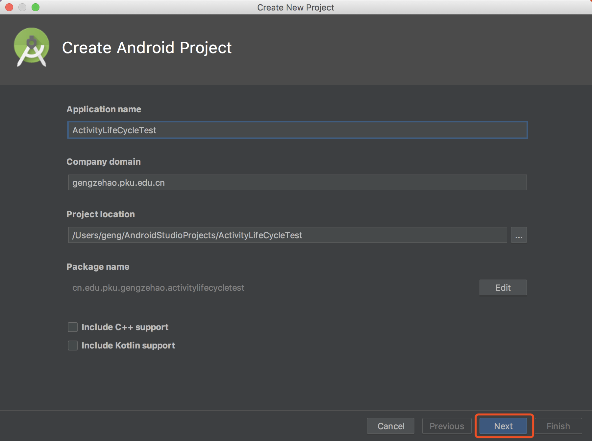

2. 保持默认选项，再点击Next。

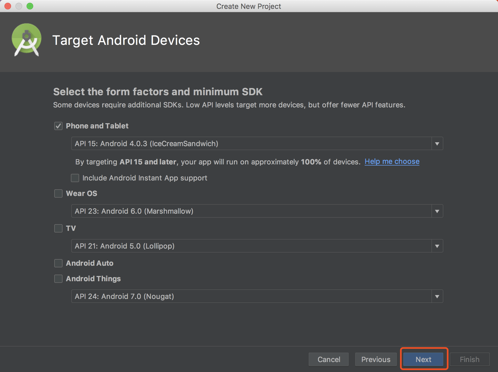

3. 选择一个空项目，让Android帮我们自动创建活动和布局。

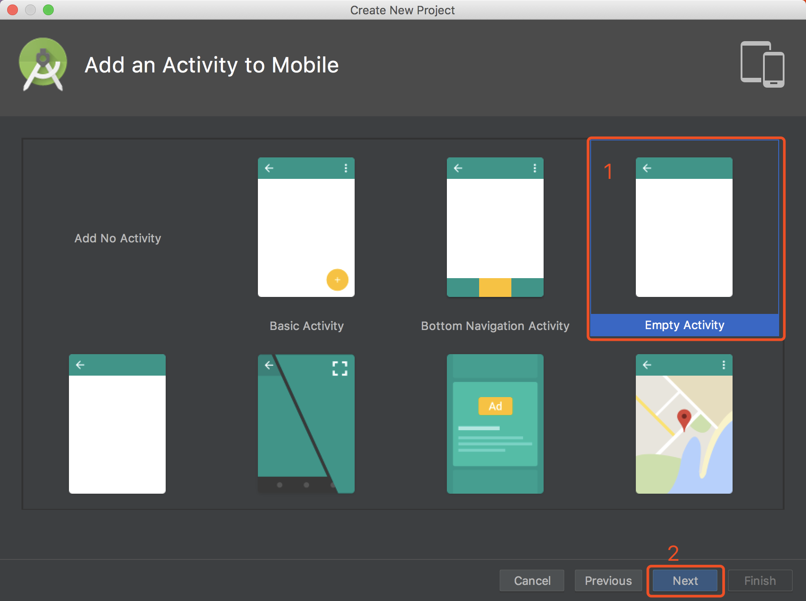

4. 活动名和布局名都是用默认值。

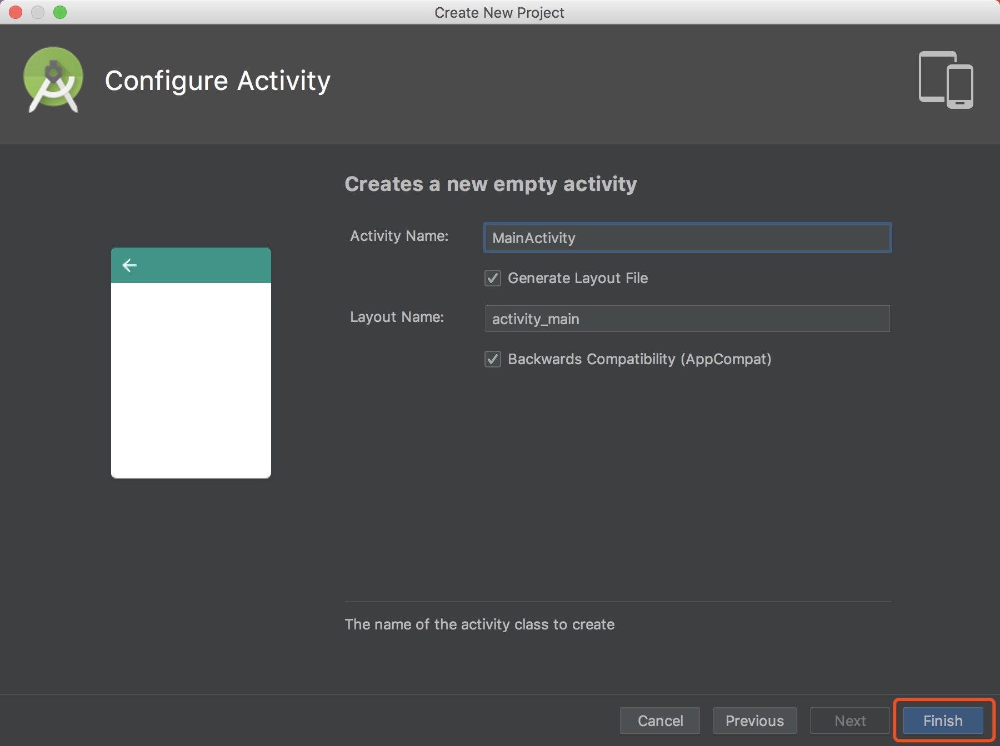

到此为止，我们的主活动就创建完毕了。

## 创建两个子活动

创建两个子活动，分别名为NormalActivity和DialogActivity。

1. 新建NormalActivity子活动。

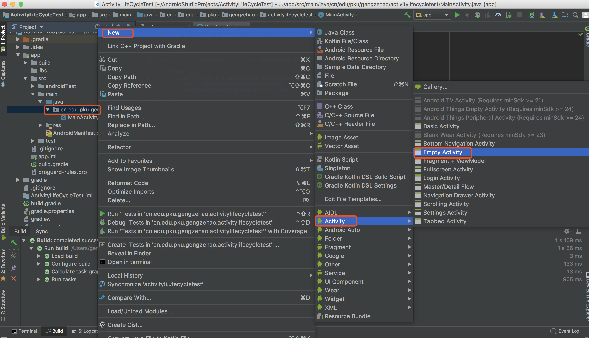

布局起名为activity_normal，点击Finish。

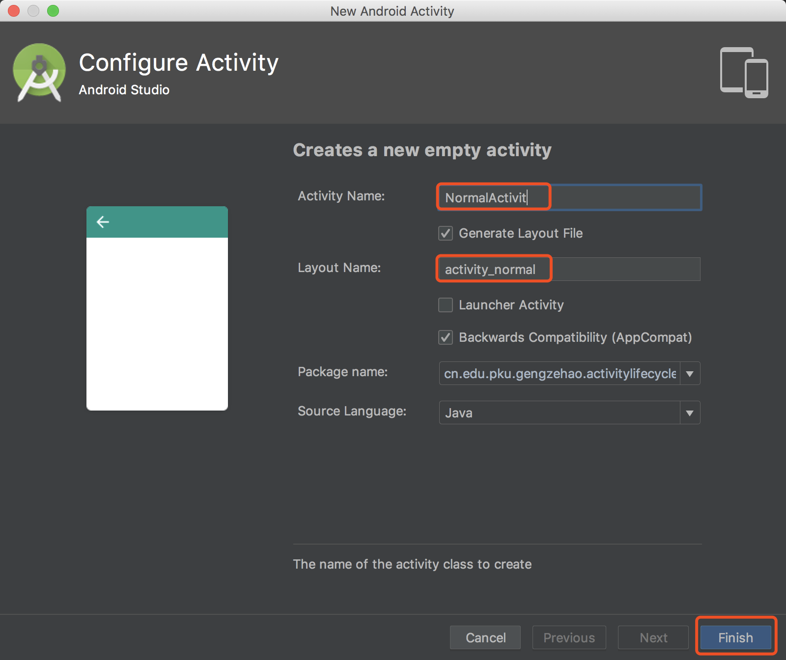

2. 新建DialogActivity子活动，布局起名为activity_dialog，创建方法同上。

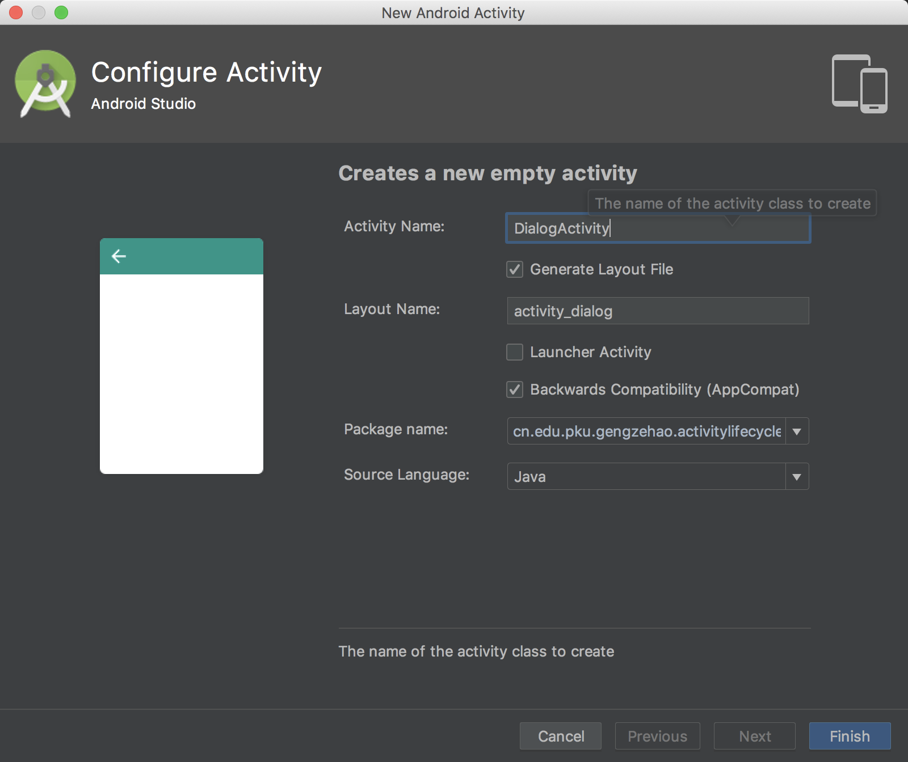

到此，两个子活动创建完毕。

## 编写活动的布局文件

1. 编写activity_normal.xml文件，将里面的代码替换成如下内容：

```xml
<?xml version="1.0" encoding="utf-8"?>
<LinearLayout xmlns:android="http://schemas.android.com/apk/res/android"
android:layout_width="match_parent"
android:layout_height="match_parent"
android:orientation="vertical">

<TextView
android:layout_width="match_parent"
android:layout_height="wrap_content"
android:text="This is a normal activity"/>

</LinearLayout>
```

这个布局中我们使用了一个TextView，用于显示一行文字。

2. 编辑activity_dialog.xml文件，将里面的内容代码替换成如下内容：

```xml
<?xml version="1.0" encoding="utf-8"?>
<LinearLayout xmlns:android="http://schemas.android.com/apk/res/android"
android:layout_width="match_parent"
android:layout_height="match_parent"
android:orientation="vertical">

<TextView
android:layout_width="match_parent"
android:layout_height="wrap_content"
android:text="This is a dialog activity"/>

</LinearLayout>
```

3.   修改AndroidManifest.xml文件的`<activity>`标签的配置，将DialogActivity活动指定为对话框式的主题。

```xml
<activity android:name=".MainActivity">
<intent-filter>
<action android:name="android.intent.action.MAIN" />

<category android:name="android.intent.category.LAUNCHER" />
</intent-filter>
</activity>
<activity android:name=".NormalActivit" />
<activity android:name=".DialogActivity"
android:theme="@style/Theme.AppCompat.Dialog">
</activity>
```

4.  修改activity_main.xml文件，重新定制主活动的布局，替换为如下内容：

```xml
<?xml version="1.0" encoding="utf-8"?>
<LinearLayout xmlns:android="http://schemas.android.com/apk/res/android"
android:layout_width="match_parent"
android:layout_height="match_parent"
android:orientation="vertical">

<Button
android:id="@+id/start_normal_activity"
android:layout_width="match_parent"
android:layout_height="wrap_content" 
android:text="Start NormalActivity"/>

<Button
android:id="@+id/start_dialog_activity"
android:layout_width="match_parent"
android:layout_height="wrap_content"
android:text="Start DialogActivity"/>

</LinearLayout>
```

我们在LineaLayout中加入了两个按钮，一个用于启动NormalActivity，一个用于启动DialogActivity。

## 修改MainActivity

```java
package cn.edu.pku.gengzehao.activitylifecycletest;

import android.content.Intent;
import android.support.v7.app.AppCompatActivity;
import android.os.Bundle;
import android.util.Log;
import android.view.View;
import android.widget.Button;

public class MainActivity extends AppCompatActivity implements View.OnClickListener {

public static final String TAG = "MainActivity";


@Override
protected void onCreate(Bundle savedInstanceState) {
super.onCreate(savedInstanceState);
Log.d(TAG, "onCreate");
setContentView(R.layout.activity_main);

Button startNormalActivity = (Button) findViewById(R.id.start_normal_activity);
startNormalActivity.setOnClickListener(this);

Button startDialogActivity = (Button) findViewById(R.id.start_dialog_activity);
startDialogActivity.setOnClickListener(this);


}

@Override
public void onClick(View v) {
if (v.getId() == R.id.start_normal_activity){
Intent intent = new Intent(MainActivity.this, NormalActivit.class);
startActivity(intent);
}

if (v.getId() == R.id.start_dialog_activity){
Intent intent = new Intent(MainActivity.this, DialogActivity.class);
startActivity(intent);
}

}

@Override
protected void onStart(){
super.onStart();
Log.d(TAG, "onStart");
}
@Override
protected void onResume(){
super.onResume();
Log.d(TAG, "onResume");
}
@Override
protected void onPause(){
super.onPause();
Log.d(TAG, "onPause");
}
@Override
protected void onStop(){
super.onStop();
Log.d(TAG, "onStop");
}
@Override
protected void onDestroy(){
super.onDestroy();
Log.d(TAG, "onDestroy");
}
@Override
protected void onRestart(){
super.onRestart();
Log.d(TAG, "onRestart");
}

}

```

再onCreate方法中，我们我们分别为两个按钮注册了点击事件，点击第一个按钮会启动NoramalActivity。点击第二个按钮会启动DialogActivity。然后再Activity的7个回调方法中分别打印了回调方法的名字，这样就可以通过观察日志的方式来更直观的理解活动的生命周期。

## 运行程序

1. 启动程序：

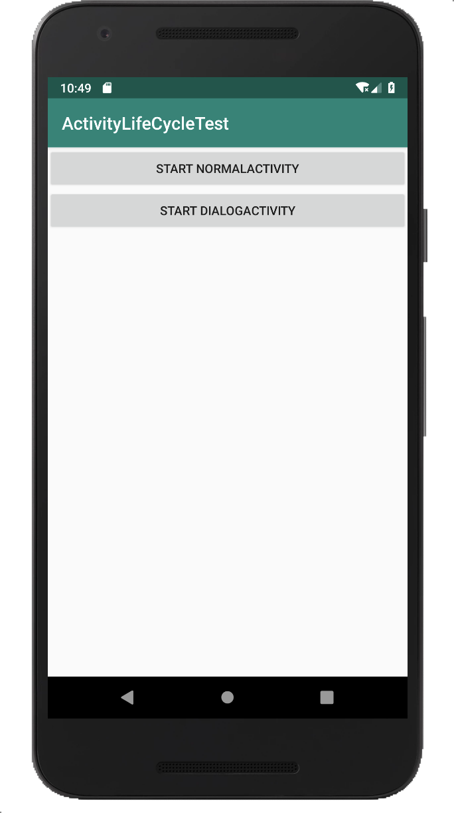

启动程序时，logcat中的日志信息如下图，可以看到当MainActivity第一被创建时会一次执行onCreate()、onStart()、onResume()方法。

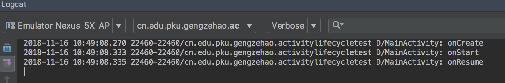

2. 点击一个按钮，启动NormalActivity。

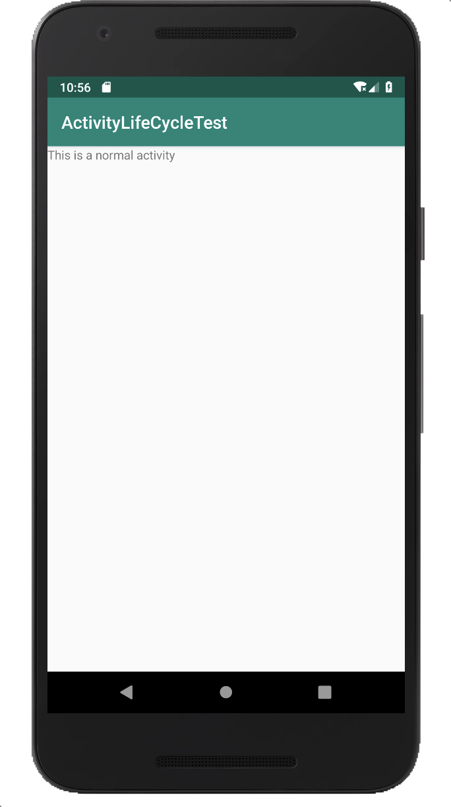

打开NormalActivity时的打印日志：

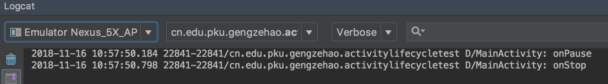

由于NormalActivity已经把MainActivity完全遮挡，因此onPause()和onStop()方法都会得到执行。

3. 按下Back键返回MainActivity的打印日志信息如下。

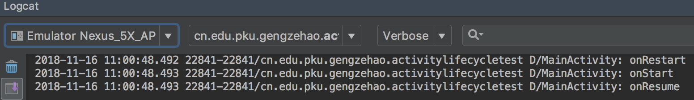

由于之前的MainActivity已经进入了停止状态，所以onRestart() 方法才会的到执行，之后又会依次执行onSrart()  和onResume()方法。值的注意的是，此时onCreate()方法不会执行。

4. 再点击第二个按钮，启动DialogActivity。

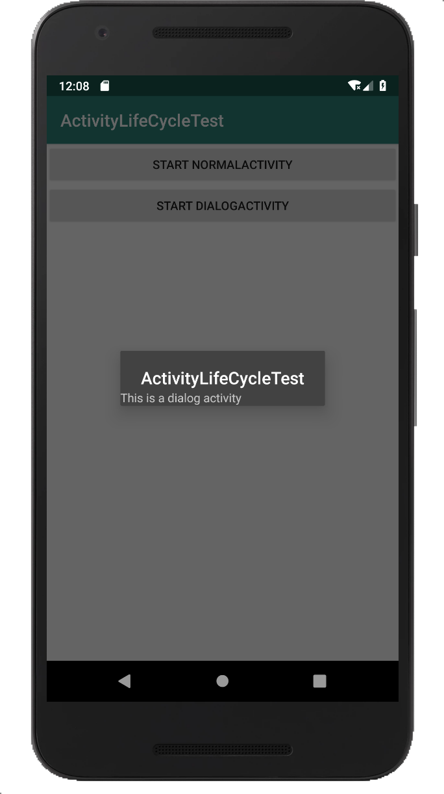

打开DialogActivity时的打印日志：

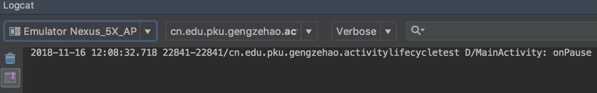

只有onPause()方法得到了执行，onStop()方法并没有执行。这是因为DialogActivity并没有完全遮挡住MainActivity，此时MainActivity只是进入了暂停状态，并没有进入停止状态。

5. 按下Back键再次返回MainActivity时的打印日志为：

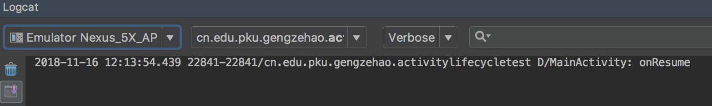

可以看到，只有onResume ()方法得到了执行。

6. 最后，在MainActivity按下Back键退出程序，打印日志如下：

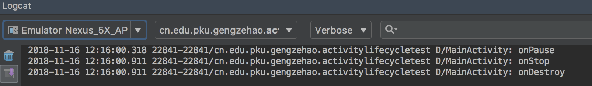

依次会执行onPause()、onStop()、 onDestroy()方法，最终销毁MainActivity。

## 参考文献

《第一行代码 Android》郭霖  

