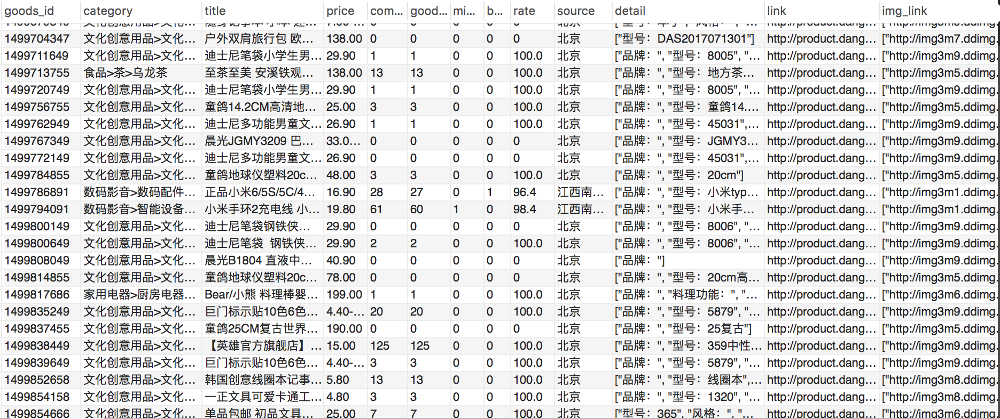
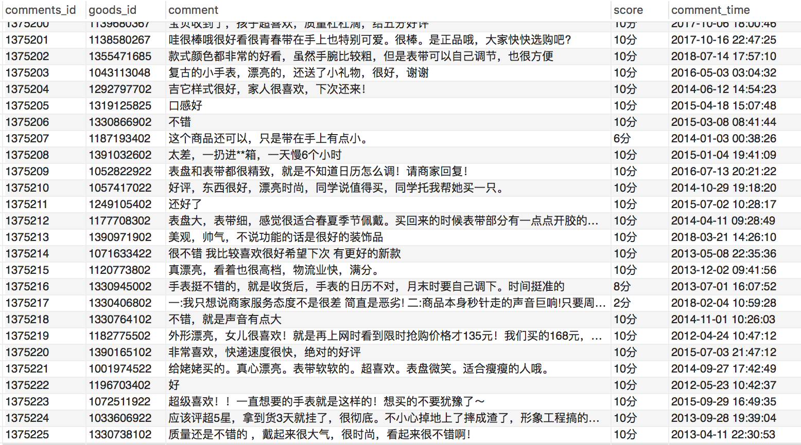

# 前言

本项目所爬取的数据为当当网站的商品信息以及商品的评论信息，并分别存储到数据库的商品信息表和评论信息表两个表中。

本项目通过使用Scrapy框架的CrawlSpider类，对当当全网商品信息进行爬取并将信息保存至mysql数据库，当当网反爬措施是对IP访问频率的限制，所以本项目使用了中间件`scrapy-rotating-proxies`来管控IP代理池，有关代理ip的爬取请见我的另一篇博文。

CrawlSpider是Spider的派生类，Spider类的设计原则是只爬取start_url列表中的网页，而CrawlSpider类通过定义一些规则(rule)来跟进所爬取网页中的link，从爬取的网页中获取link并继续爬取。

Github地址: https://github.com/RunningGump/crawl_dangdang

# 依赖

1. scrapy 1.5.0
2. python3.6
3. mysql 5.7.24
4. pymysql 库
5. scrapy-rotating-proxies 库
6. fake-useragent 库

# 创建项目

首先，我们需要创建一个Scrapy项目，在shell中使用`scrapy startproject`命令：

```bash
$ scrapy startproject Dangdang
New Scrapy project 'Dangdang', using template directory '/usr/local/lib/python3.6/dist-packages/scrapy/templates/project', created in:
    /home/geng/Dangdang

You can start your first spider with:
    cd Dangdang
    scrapy genspider example example.com
```

创建好一个名为`Dangdang`的项目后，接下来，你进入新建的项目目录：

```bash
$ cd Dangdang
```

然后,使用`scrapy genspider -t <template> <name> <domain>`创建一个spider：

```bash
$ scrapy genspider -t crawl dd dangdang.com
Created spider 'dd' using template 'crawl' in module:
  Dangdang.spiders.dd
```

此时，你通过`cd ..`返回上级目录，使用`tree`命令查看项目目录下的文件，显示如下：

```bash
$ cd ..
$ tree Dangdang/
Dangdang/
├── Dangdang
│   ├── __init__.py
│   ├── items.py
│   ├── middlewares.py
│   ├── pipelines.py
│   ├── __pycache__
│   │   ├── __init__.cpython-36.pyc
│   │   └── settings.cpython-36.pyc
│   ├── settings.py
│   └── spiders
│       ├── dd.py
│       ├── __init__.py
│       └── __pycache__
│           └── __init__.cpython-36.pyc
└── scrapy.cfg

4 directories, 11 files
```

到此为止，我们的项目就创建成功了。


# rules

在rules中包含一个或多个Rule对象，每个Rule对爬取网站的动作设置了爬取规则。

 **参数介绍：**

`link_extractor`：是一个Link Extractor对象，用于定义需要提取的链接。

`callback`： 回调函数，对link_extractor获得的链接进行处理与解析。

**注意事项：**当编写爬虫规则时，避免使用parse作为回调函数。由于CrawlSpider使用parse方法来实现其逻辑，如果覆盖了 parse方法，crawl spider将会运行失败。

`follow`：是一个布尔(boolean)值，指定了根据规则从response提取的链接是否需要跟进。 如果callback为None，follow 默认设置为True ，否则默认为False

`process_links`：指定该spider中哪个的函数将会被调用，从link_extractor中获取到链接列表时将会调用该函数。该方法主要用来过滤链接。          

`process_request`：指定该spider中哪个的函数将会被调用， 该规则提取到每个request时都会调用该函数。 (用来过滤request)

# LinkExtrator

**参数介绍：**

`allow`：满足括号中“正则表达式”的值会被提取，如果为空，则全部匹配。

`deny`：与这个正则表达式(或正则表达式列表)匹配的URL不提取。

`allow_domains`：会被提取的链接的域名。

`deny_domains`：不会被提取链接的域名。

`restrict_xpaths`：使用Xpath表达式与allow共同作用提取出同时符合对应Xpath表达式和正则表达式的链接；

# 项目代码

## 编写item.py文件

```python
# -*- coding: utf-8 -*-
import scrapy
class DangdangItem(scrapy.Item):
    goods_id = scrapy.Field() # 商品id
    category = scrapy.Field()  # 商品类别
    title = scrapy.Field()   # 商品名称
    link = scrapy.Field()    # 商品链接
    price = scrapy.Field()   # 商品价格
    comment_num = scrapy.Field()  # 商品评论数
    good_comment_num = scrapy.Field() # 商品好评数
    mid_comment_num = scrapy.Field() # 商品中评数
    bad_comment_num = scrapy.Field() # 商品差评数
    rate = scrapy.Field()   # 商品的好评率
    source = scrapy.Field()   # 商品的来源地
    detail = scrapy.Field()   # 商品详情
    img_link = scrapy.Field() #商品图片链接

class CommentItem(scrapy.Item):
    goods_id = scrapy.Field() # 商品id
    comment = scrapy.Field() # 商品的所有评论
    score = scrapy.Field() # 评论对应的评分
    time = scrapy.Field()  # 评论的时间


```

## 编写pipeline.py文件

需提前创建好数据库，本项目创建的数据库名字为`dd`，并创建了两个数据表`goods`,`comments`。

```python
# -*- coding: utf-8 -*-
import pymysql
from scrapy.conf import settings
import json
from Dangdang.items import DangdangItem
from Dangdang.items import CommentItem

## pipeline默认是不开启的，需在settings.py中开启
class DangdangPipeline(object):
    def process_item(self, item, spider):
        # 连接数据库
        conn = pymysql.connect(host="localhost",user="root",passwd='******',db="dd",use_unicode=True, charset="utf8")
        cur = conn.cursor()             # 用来获得python执行Mysql命令的方法,也就是我们所说的操作游标
        print("mysql connect success")  # 测试语句，这在程序执行时非常有效的理解程序是否执行到这一步
        # 存储当当商品信息的逻辑
        if isinstance(item, DangdangItem): # 判断传入的item是否为DangdangItem
            try:
                goods_id = item["goods_id"]
                category = item["category"]
                title = item["title"]
                if len(title)>40:
                    title = title[0:40] + '...'
                link = item["link"]
                img_link = item['img_link']
                price = item["price"]
                comment_num = item["comment_num"]
                good_comment_num = item["good_comment_num"]
                mid_comment_num = item["mid_comment_num"]
                bad_comment_num = item["bad_comment_num"]
                rate = item["rate"]
                source = item["source"]
                detail = item["detail"]

                sql = "INSERT INTO goods(goods_id,category,title,price,comment_num,good_comment_num,mid_comment_num,bad_comment_num,rate,source,detail,link,img_link) VALUES ('%s','%s','%s','%s','%s','%s','%s','%s','%s','%s','%s','%s','%s')" % \
                                        (goods_id,category,title,price,comment_num,good_comment_num,mid_comment_num,bad_comment_num,rate,source,detail,link,img_link)
                print(sql)
            except Exception as err:
                print(err,'EORR1111!!!')

            '''########################################################
                        执行sql语句，将商品信息存入goods数据表             
            ########################################################'''
            try:
                cur.execute(sql)         # 真正执行MySQL语句，即查询TABLE_PARAMS表的数据
                print("insert goods success")  # 测试语句
            except Exception as err:
                print(err)
                conn.rollback() #事务回滚,为了保证数据的有效性将数据恢复到本次操作之前的状态.有时候会存在一个事务包含多个操作，而多个操作又都有顺序，顺序执行操作时，有一个执行失败，则之前操作成功的也会回滚，即未操作的状态
            else:
                conn.commit()   #当没有发生异常时，提交事务，避免出现一些不必要的错误

        elif isinstance(item, CommentItem): # 判断传入的item是否为CommentItem
            try:
                # 遍历所有评论
                goods_id = item["goods_id"]
                comment = item["comment"]
                score = item ["score"]
                comment_time = item["time"]

                sql2 = "INSERT INTO comments(goods_id,comment,score,comment_time) VALUES ('%s','%s','%s','%s')" % \
                                            (goods_id,comment,score,comment_time)
                print(sql2)
            except Exception as err:
                print(err,'EORR222!!!')

            '''########################################################
                        执行sql语句，将评论信息存入comments数据表             
            ########################################################'''
            try:
                cur.execute(sql2)         # 真正执行MySQL语句，即查询TABLE_PARAMS表的数据
                print("insert comments success")  # 测试语句
            except Exception as err:
                print(err)
                conn.rollback() #事务回滚,为了保证数据的有效性将数据恢复到本次操作之前的状态.有时候会存在一个事务包含多个操作，而多个操作又都有顺序，顺序执行操作时，有一个执行失败，则之前操作成功的也会回滚，即未操作的状态
            else:
                conn.commit()   #当没有发生异常时，提交事务，避免出现一些不必要的错误

        conn.close()  #关闭连接 

        return item   #框架要求返回一个item对象

```

## 编写middlewares.py

本项目添加了`RandomUserAgentMiddleWare`中间件，用来随机更换UserAgent。在`middlewares.py`文件的最后面添加如下中间件：

```python
from fake_useragent import UserAgent

class RandomUserAgentMiddleWare(object):
    """
    随机更换User-Agent，避免ban user-agent.
    """
    def __init__(self,crawler):
        super(RandomUserAgentMiddleWare, self).__init__()
        self.ua = UserAgent()
        self.ua_type = crawler.settings.get("RANDOM_UA_TYPE", "random")

    @classmethod
    def from_crawler(cls, crawler):
        return cls(crawler)

    def process_request(self, request, spider):
        def get_ua_type():
            return getattr(self.ua, self.ua_type)   # 取对象 ua 的 ua_type 的这个属性, 相当于 self.ua.self.ua_type

        request.headers.setdefault('User-Agent', get_ua_type())
```

## 修改settings.py 文件

```python
BOT_NAME = 'Dangdang'

SPIDER_MODULES = ['Dangdang.spiders']
NEWSPIDER_MODULE = 'Dangdang.spiders'

# 不遵循robots协议
ROBOTSTXT_OBEY = False

# 下载延迟设置为0，提高爬取速度
DOWNLOAD_DELAY = 0

#禁用Cookie(默认情况下启用)
COOKIES_ENABLED = False  

# 启用所需要的下载中间件,对于爬取当当网也可以将1，2，4注释掉。
DOWNLOADER_MIDDLEWARES = {
    'rotating_proxies.middlewares.RotatingProxyMiddleware': 610,
    'rotating_proxies.middlewares.BanDetectionMiddleware': 620,
    'scrapy.downloadermiddlewares.useragent.UserAgentMiddleware': None,
    'Dangdang.middlewares.RandomUserAgentMiddleWare': 400,
}
# 代理IP文件路径,此处需改为你自己的路径
ROTATING_PROXY_LIST_PATH = '/home/geng/Projects/Dangdang/proxy.txt'

# 随机更换UserAgent 
RANDOM_UA_TYPE = "random"

# 开启pipeline
ITEM_PIPELINES = {
   'Dangdang.pipelines.DangdangPipeline': 300,
}
```

## spider文件(dd.py)编写

```python
# -*- coding: utf-8 -*-
import scrapy
from scrapy.linkextractors import LinkExtractor
from scrapy.spiders import CrawlSpider, Rule
from Dangdang.items import DangdangItem
from Dangdang.items import CommentItem
import re
import urllib.request
import json
import requests
from lxml import etree


class DdSpider(CrawlSpider):
    name = 'dd'
    allowed_domains = ['dangdang.com']
    start_urls = ['http://category.dangdang.com/']

    # 分析网页链接，编写rules规则,提取商品详情页的链接
    rules = (
        Rule(LinkExtractor(allow=r'/cp\d{2}.\d{2}.\d{2}.\d{2}.\d{2}.\d{2}.html$|/pg\d+-cp\d{2}.\d{2}.\d{2}.\d{2}.\d{2}.\d{2}.html$', deny=r'/cp98.\d{2}.\d{2}.\d{2}.\d{2}.\d{2}.\d{2}.html'),
             follow=True),
        Rule(LinkExtractor(allow=r'/cid\d+.html$|/pg\d+-cid\d+.html$', deny=r'/cp98.\d{2}.\d{2}.\d{2}.\d{2}.\d{2}.\d{2}.html'),
             follow=True),
        Rule(LinkExtractor(allow=r'product.dangdang.com/\d+.html$', restrict_xpaths=("//p[@class='name']/a")),
             callback='parse_item',
             follow=False),      # allow与restrict_xpath配合使用,效果很好,可以更精准筛选链接.
    )

    # 解析商品详情页面
    def parse_item(self, response):
        item = DangdangItem()  # 实例化item
        commment_item = CommentItem()
        item["category"] = response.xpath('//*[@id="breadcrumb"]/a[1]/b/text()').extract_first()+'>'+response.xpath('//*[@id="breadcrumb"]/a[2]/text()').extract_first()+'>'+response.xpath('//*[@id="breadcrumb"]/a[3]/text()').extract_first()
        item["title"] = response.xpath("//*[@id='product_info']/div[1]/h1/@title").extract_first()
        item["detail"] = json.dumps(response.xpath("//*[@id='detail_describe']/ul//li/text()").extract(),ensure_ascii=False)
        item["link"] = response.url
        item["img_link"] =json.dumps(response.xpath("//div[@class='img_list']/ul//li/a/@data-imghref").extract())
        try:
            item["price"] = response.xpath("//*[@id='dd-price']/text()").extract()[1].strip()
        except IndexError as e:
            item["price"] = response.xpath("//*[@id='dd-price']/text()").extract()[0].strip()
        item["comment_num"] = response.xpath("//*[@id='comm_num_down']/text()").extract()[0]

        try:
            item["source"] = response.xpath("//*[@id='shop-geo-name']/text()").extract()[0].replace('\xa0至','')
        except IndexError as e:
            item["source"] = '当当自营'
        
        # 通过正则表达式提取url中的商品id
        goodsid = re.compile('\/(\d+).html').findall(response.url)[0]  
        commment_item['goods_id'] = goodsid
        item["goods_id"] = goodsid

        '''########################################################
                      通过抓包分析,提取商品的好评率             
        ########################################################'''
        # 提取详情页源码中的categoryPath
        script = response.xpath("/html/body/script[1]/text()").extract()[0]
        categoryPath = re.compile(r'.*categoryPath":"(.*?)","describeMap').findall(script)[0]
        # 构造包含好评率包的链接
        rate_url = "http://product.dangdang.com/index.php?r=comment%2Flist&productId="+str(goodsid)+"&categoryPath="+str(categoryPath)+"&mainProductId="+str(goodsid)
        r = requests.get(rate_url)
        data_dict = json.loads(r.text)
        item["rate"] = data_dict['data']['list']['summary']['goodRate']
        item["good_comment_num"] = data_dict['data']['list']['summary']['total_crazy_count']
        item["mid_comment_num"] = data_dict['data']['list']['summary']['total_indifferent_count']
        item["bad_comment_num"] = data_dict['data']['list']['summary']['total_detest_count']
        yield item

        '''#####################################################
                         开始对评论、评分进行清洗并爬取                 
        #####################################################'''
        html_str = data_dict['data']['list']['html']
        html = etree.HTML(html_str)
        comment_items = html.xpath('//div[@class="comment_items clearfix"]')
        pageIndex = 1
        while comment_items:   
            pageIndex += 1
            for item in comment_items:
                comment_unit = item.xpath('.//div[@class="describe_detail"][1]/span[not(@class="icon")]/text()')
                score = item.xpath('.//div[@class="pinglun"]/em/text()')[0]
                time = item.xpath('.//div[@class="items_right"]/div[@class="starline clearfix"][1]/span[1]/text()')[0]
                comment = ' '.join(comment_unit)
                commment_item["comment"] = comment 
                commment_item['score'] = score
                commment_item["time"] = time
                yield commment_item


            rate_url = "http://product.dangdang.com/index.php?r=comment%2Flist&productId="+str(goodsid)+"&categoryPath="+str(categoryPath)+"&mainProductId="+str(goodsid) + "&pageIndex=" + str(pageIndex)
            r = requests.get(rate_url)
            data_dict = json.loads(r.text)
            html_str = data_dict['data']['list']['html']
            html = etree.HTML(html_str)
            comment_items = html.xpath('//div[@class="comment_items clearfix"]')
```

# 建立数据库

本项目使用的是mysql数据库，创建数据库的名字为dd，且创建了两个数据表分别为goods和comments，这两个表的结构如下：

`goods`表中的字段：

`goods_id`,`category`,`title`,`price`,`comment_num`,`good_comment_num`,`mid_comment_num`,`bad_comment_num`,`rate`,`source`,`detail`, `link`,`img_link`。分别代表商品id(主键)、商品类别、商品名称、商品价格、评论数量、好评数、中评数、差评数、好评率、商品来源、商品详情、商品连接（unique）、商品图片连接。

`comments`表中的字段：

`comments_id`,`goods_id`,`comment`,`score`,`comment_time`。分别代表评论id（主键）、商品id、评论、商品评分、评论时间。

关于创建数据库/表的操作这里不再赘述，请自行百度。

# 使用方法

以上步骤操作完成后，在命令行中执行以下命令开始爬取：

```bash
$ scrapy crawl dd
```

# 结果展示

共爬取了**214673**条商品信息，和**1375225**条评论信息。（这并不是当当全部商品信息哦，我仅爬取了一部分）

**商品信息表：**



**评论信息表：**



