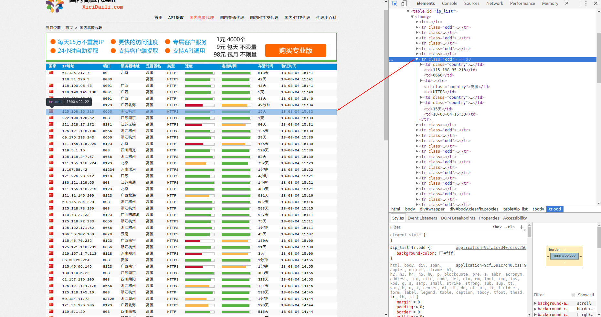

# 前言

在爬取网站数据的时候，一些网站会对用户的访问频率进行限制，如果爬取过快会被封ip，而使用代理可防止被封禁。本项目使用scrapy框架对[西刺网站](http://www.xicidaili.com/)进行爬取，并验证爬取代理的有效性，最终将有效的代理输出并存储到json文件中。

Github地址: https://github.com/RunningGump/crawl_xiciproxy

# 依赖

1. python3.6
2. Scrapy 1.5.0

# 创建项目

首先，我们需要创建一个Scrapy项目，在shell中使用`scrapy startproject`命令：

```bash
$ scrapy startproject xiciproxy
New Scrapy project 'xiciproxy', using template directory '/usr/local/lib/python3.6/dist-packages/scrapy/templates/project', created in:
    /home/geng/xiciproxy

You can start your first spider with:
    cd xiciproxy
    scrapy genspider example example.com
```

创建好一个名为`xiciproject`的项目后，接下来，你进入新建的项目目录：

```bash
$ cd xiciproxy
```

然后,使用`scrapy genspider <name> <domain>`创建一个spider：

```bash
$ scrapy genspider xici xicidaili.com
Created spider 'xici' using template 'basic' in module:
  xiciproxy.spiders.xici
```

此时，你通过`cd ..`返回上级目录，使用`tree`命令查看项目目录下的文件，显示如下：

```bash
$ cd ..
$ tree xiciproxy
xiciproxy
├── scrapy.cfg
└── xiciproxy
    ├── __init__.py
    ├── items.py
    ├── middlewares.py
    ├── pipelines.py
    ├── __pycache__
    │   ├── __init__.cpython-36.pyc
    │   └── settings.cpython-36.pyc
    ├── settings.py
    └── spiders
        ├── __init__.py
        ├── __pycache__
        │   └── __init__.cpython-36.pyc
        └── xici.py

4 directories, 11 files

```

到此为止，我们的项目就创建成功了。

# 分析页面

编写爬虫程序之间，首先需要对待爬取的页面进行分析，主流的浏览器中都带有分析页面的工具或插件，这里我们选用Chrome浏览器的开发者工具分析页面。

## 链接信息

在Chrome浏览器中打开页面http://www.xicidaili.com/, 通过点击`国内高匿代理`和`国内普通代理`以及进行翻页操作，会发现以下规律：

`http://www.xicidaili.com/参数1/参数2`

参数1中`nn`代表高匿代理，`nt`代表普通代理；参数2中1,2,3,4...代表页数。

## 数据信息

爬取网页信息时一般使用高匿代理，高匿代理不改变客户机的请求，这样在服务器看来就像有个真正的客户浏览器在访问它，这时客户的真是IP是隐藏的，不会认为我们使用了代理。

本部分以爬取高匿代理为例子来分析如何爬取网页的数据信息。在Chrome浏览器中打开页面http://www.xicidaili.com/nn, 并按`F12`键来打开开发者工具，点击Elements（元素）来查看其HTML代码，会发现每一条代理的信息都包裹在一个`tr`标签下，如下图所示：



再来单独对一个`tr`标签进行分析：

```html
<tr class="odd">
      <td class="country"></td>
      <td>115.198.35.213</td>
      <td>6666</td>
      <td>
        <a href="/2018-07-20/zhejiang">浙江杭州</a>
      </td>
      <td class="country">高匿</td>
      <td>HTTPS</td>
      <td class="country">
        <div title="0.144秒" class="bar">
          <div class="bar_inner fast" style="width:85%">
            
          </div>
        </div>
      </td>
      <td class="country">
        <div title="0.028秒" class="bar">
          <div class="bar_inner fast" style="width:96%">
            
          </div>
        </div>
      </td>
      
      <td>15天</td>
      <td>18-08-04 15:33</td>
    </tr>
```

会发现：IP地址包裹在`td[2]`标签下，端口port包裹在`td[3]`标签下，类型（http/https）包裹在`td[6]`标签下。

# 程序编写

分析完页面后，接下来编写爬虫。本项目主要是对`xici.py`进行编写，对`settings.py`仅做了轻微改动。

## 实现spider

即编写`xici.py`文件，程序如下：

```python
import scrapy
import json
'''
scrapy crawl xici -o out.json -a num_pages=50 -a typ=nn
其中`out.json`是输出有效代理的json文件，`num_pages`是爬取页数，`typ`表示代理类型，`nn`是高匿代理，`nt`是普通代理。

'''
class XiCiSpider(scrapy.Spider):
    # 每一个爬虫的唯一标识
    name = 'xici'
    # 使用-a选项,可以将命令行参数传递给spider的__init__方法
    def __init__(self, num_pages=5, typ='nn', *args, **kwargs):
        num_pages = int(num_pages)
        self.num_pages = num_pages
        self.typ = typ
        
    # 定义起始爬取点
    def start_requests(self): 
        for page in range(1, self.num_pages + 1):
            url = 'http://www.xicidaili.com/{}/{}'.format(self.typ, page)
            yield scrapy.Request(url=url)

    # 解析response返回的网页
    def parse(self, response):
        proxy_list = response.xpath('//table[@id = "ip_list"]/tr[position()>1]')  
        for tr in proxy_list:
            # 提取代理的 ip, port, scheme(http or https)
            ip = tr.xpath('td[2]/text()').extract_first()
            port = tr.xpath('td[3]/text()').extract_first()
            scheme = tr.xpath('td[6]/text()').extract_first()

            # 使用爬取到的代理再次发送请求到http(s)://httpbin.org/ip, 验证代理是否可用
            url = '%s://httpbin.org/ip' % scheme
            proxy = '%s://%s:%s' % (scheme, ip, port)


            meta = {
                'proxy': proxy,
                'dont_retry': True,
                'download_timeout': 5,
                # 下面的ip字段是传递给check_available方法的信息,方便检测是否可隐藏ip
                '_proxy_ip':ip,
            }
            yield scrapy.Request(url, callback=self.check_available, meta=meta, dont_filter=True)
        
    def check_available(self, response):
        proxy_ip = response.meta['_proxy_ip']
        # 判断代理是否具有隐藏IP功能
        if proxy_ip == json.loads(response.text)['origin']:
            yield{
                'proxy': response.meta['proxy']
            }

```

## 修改配置文件

- 更改USER_AGENT：西刺代理网站会通过识别请求中的user-agent来判断这次请求是真实用户所为还是机器所为。
- 不遵守robots协议：网站会通过robots协议告诉搜索引擎那些页面可以抓取，哪些不可以抓取，而robots协议大多不允许抓取有价值的信息，所以咱们不遵守。
- 禁用cookies：如果用不到cookies，就不要让服务器知道你的cookies。

文件`settings.py`中的改动如下：

```
USER_AGENT = "Mozilla/5.0 (X11; Linux x86_64) AppleWebKit/537.36 (KHTML, like Gecko) Chrome/66.0.3359.139 Safari/537.36"
ROBOTSTXT_OBEY = True
COOKIES_ENABLED = False
```

在编写好`xici.py`和`settings.py`后，我们的项目就大功告成啦！

# 使用方法

使用方法就是在命令行中执行以下命令即可：

``` bash
$ scrapy crawl xici -o out.json -a num_pages=10 -a typ=nn
```

其中`out.json`是最终输出有效代理的json文件，`num_pages`是爬取页数，`typ`表示要爬取的代理类型，`nn`是高匿代理，`nt`是普通代理。

> **提示** ：程序在验证代理有效性的过程中，对于无效的代理会抛出超时异常，不要管这些异常，让程序继续执行直到结束。