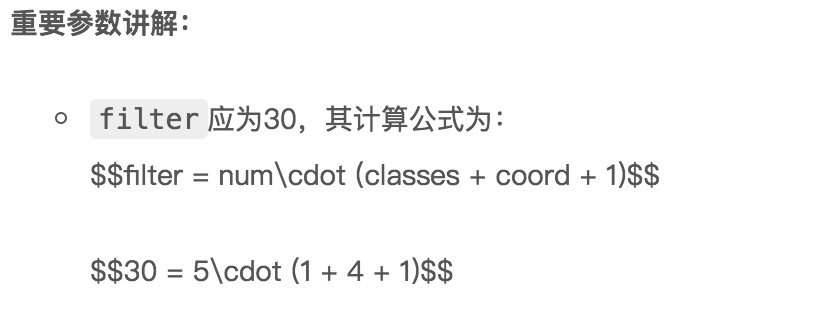
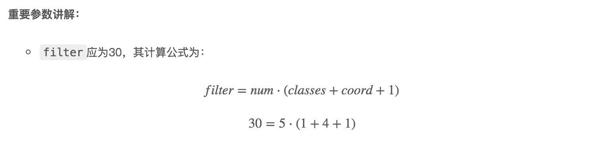

# 前言

基于Hexo搭建的个人博客，在默认情况下渲染数学公式的时候是会出现问题的。下面的截图是我的先前的博客中出现的公式渲染错误：



经过了一波百度操作后，成功将问题解决，下面是解决后的截图：



下面我将我的操作写在下面，供需要的人参考。

# 解决步骤

## 更换Hexo的markdown渲染引擎

先后执行下面的两条命令，第一条表示将默认的渲染引擎hexo-renderer-marked卸载，第二条命令是安装hexo-renderer-kramed渲染引擎，此渲染引擎修改了hexo-renderer-marked渲染引擎的一些bug。

```shell
npm uninstall hexo-renderer-marked --save
npm install hexo-renderer-kramed --save
```

## 修改node_modules\kramed\lib\rules\inline.js文件

hexo-renderer-marked渲染引擎仍然存在一些语义冲突问题，到博客的根目录下，找到node_modules\kramed\lib\rules\inline.js，把第11行的escape变量的值做相应的修改：

```shell
//  escape: /^\\([\\`*{}\[\]()#$+\-.!_>])/,
  escape: /^\\([`*\[\]()#$+\-.!_>])/,
```

这一步是在原基础上取消了对\,{,}的转义(escape)。

同时把第20行的em变量也要做相应的修改。

```shell
//  em: /^\b_((?:__|[\s\S])+?)_\b|^\*((?:\*\*|[\s\S])+?)\*(?!\*)/,
  em: /^\*((?:\*\*|[\s\S])+?)\*(?!\*)/,
```

## 在主题中开启mathjax开关

到博客根目录下，找到themes/next/_config.yml，把math默认的flase修改为true，具体如下：

```shell
# Math Equations Render Support
math:
  enable: true
  per_page: true
  engine: mathjax
```

## 在文章的Front-matter里打开mathjax开关

如果你写的文章里面用到了数学公式，需要在文章Front-matter里打开mathjax开关。如果用不到数学公式，则不需要管它。

```shell
---
title: index.html
date: 2018-12-5 01:30:30
tags:
mathjax: true
--
```

## 重启hexo

```shell
hexo clean #清除缓存文件
hexo g -d  #生成并部署hexo
```

到这里，hexo中无法显示数学公式的问题就得到解决了！

# 参考文献

[在Hexo中渲染MathJax数学公式](https://www.jianshu.com/p/7ab21c7f0674)

