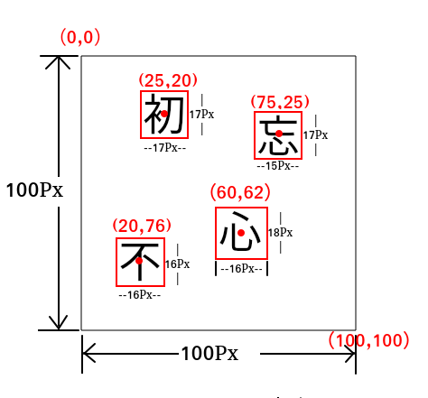

# 设计思路

## 前言

[国家企业信用信息公示系统](http://www.gsxt.gov.cn/index.html)中的验证码是按语序点击汉字，如下图所示：


即，如果依次点击：‘无’，‘意’，‘中’，‘发’，‘现’，就会通过验证。

本项目的**破解思路**主要分为以下步骤：

1. 使用目标探测网络YOLOV2进行**汉字定位**
2. 设计算法进行**汉字切割**
3. 使用darknet的分类器进行**汉字识别**
4. 设计算法进行**汉字纠错与语序识别**

[Github仓库直通车](https://github.com/RunningGump/gsxt_captcha)

## 汉字定位与汉字识别

本项目的汉字定位和汉字识别部分都是基于`darknet`框架进行训练的。本项目对它们使用的训练网络并没有太高要求，只需懂得如何使用darknet就可以了，关于如何使用darknet框架训练汉字定位模型和汉字识别模型可查阅**模型训练文档**以及[官方文档](https://pjreddie.com/darknet/)的YOLO和Train a Classifier部分。那么，下面主要对汉字切割和语序识别进行讲解，最后再对整个破解程序进行讲解。

## 汉字切割算法

```python
def seg_one_img(img_path, rets):
    img = cv2.imread(img_path)
    hanzi_list = [] # 用于记录每个汉字对应的坐标：key为切割后汉字图片路径，value为中心点坐标
    # 对定位框进行遍历
    for ret in rets:
        per_dict = {}
        if ret[1] > 0.5: # 只取置信度大于0.5的定位框
            coordinate = ret[2] # ret[2]为定位器返回的归一化坐标（x,y,w,h）
            center = (int(coordinate[0]*344), int(coordinate[1]*384)) #汉字定位框中心点坐标
            origin = (coordinate[0] - coordinate[2]/2, 
                    coordinate[1] - coordinate[3]/2) # 汉字定位框左上角坐标（归一化）
            # 将定位框向四周均匀扩大2个像素，尽量将整个汉字切割下来。
            x = int(origin[0]*344 - 2)
            x_plus_w =int((origin[0] + coordinate[2])*344 + 4)
            y = int(origin[1]*384 - 2)
            y_plus_h = int((origin[1] + coordinate[3])*384 + 4)
            # 扩大后的定位框可能会出现越界的可能，如一个紧挨着图片边缘的汉字，fix函数调整越界的定位框
            x, y, x_plus_w, y_plus_h = fix(x,y,x_plus_w,y_plus_h)
            # 下面对图片进行切割，并保存
            try:
                hanzi_img = img[y:y_plus_h, x:x_plus_w] # 切割
                normal_img = cv2.resize(hanzi_img, (65,65), 
                        interpolation=cv2.INTER_CUBIC) # 将截取的图片规范化为65*65*3
                path = 'hanzi_img/{}_label.jpg.format(timestamp())
                cv2.imwrite(path, normal_img)
                per_dict[path] = center
                hanzi_list.append(per_dict) 
            except:
                print('#'*20)
                print('存在不规则的图片')
    return hanzi_list

# 修正定位框的坐标，如果扩大后的定位框越界则将其设置为边界坐标
def fix(x, y, x_plus_w, y_plus_h ):
    x = 0 if x < 0 else x
    y = 0 if y < 0 else y
    x_plus_w = 384 if x_plus_w > 384 else x_plus_w
    y_plus_h = 344 if y_plus_h > 344 else y_plus_h
    return x, y, x_plus_w, y_plus_h

```

`seg_one_img`函数是对一张验证码图片进行汉字切割，切割后的汉字图片保存在当前路径下的`hanzi_img`文件夹中，并且返回由字典（key为汉字图片路径，value为坐标）组成的列表。需要注意的是，定位接口返回的定位框信息均是归一化信息，需要转换成实际的坐标信息，验证码图片大小信息为：344 × 384 × 3。如（0.25，,75）>> (0.25×344,0.75×384)

**算法大体思路：**

切割一张图片（图片路径，定位接口返回的定位框信息）：

	遍历定位框信息，对置信度大于0.5的定位框进行如下操作：
	
		计算汉字定位框中心坐标和左上角坐标；
	
		将汉字定位框向四周均匀扩大两个像素；
	
		对越界的坐标进行修正；
	
		对汉字进行切割；

定位框向四周扩大两个像素的目的：尽量将整个汉字切割下来。因为经过测试，有些定位框定位正确但是IOU不是很高，即汉字的某一小部分可能在定位框外部。扩大定位框可以更好的用于后面的汉字识别。

## 语序识别算法

语序识别算法结合了**使用结巴分词识别语序**和**使用搜索引擎识别语序**两个函数，下面分别对两个函数进行讲解。

### 使用结巴分词识别语序

本部分使用的是 Python 中文分词词库`jieba`，关于结巴分词的基础知识请先阅读[结巴分词Github文档](https://github.com/fxsjy/jieba)，下面对使用结巴分词识别语序进行讲解。

```python
# 结巴分词 识别语序
def recog_order_jieba(str):
    l = len(str) # l表示输入字符串个数
    word_list = _permutation(str) # 获得该字符串的所有排列方式
    possible_words = [] # 用来存放语序可能正确的词
    for word in word_list:  # 编列所有排列方式
        seg_list = jieba.lcut(word, cut_all=True ) # 对某一种排列方式使用结巴分词
        index = find_longest(seg_list)  # 寻找结巴分词返回的列表中字符串最长的索引，并返回
        if len(seg_list[index]) == l: # 若最长的字符串与输入的字符串长度相同，则加入可能正确列表
            possible_words.append(seg_list[index])
    if len(possible_words) ==1: # 遍历完后，若可能正确的列表只有一个元素，那么他就是正确的，返回
        return possible_words[0]
    elif len(possible_words) >1: # 若有可能正确列表中若有多个元素，则选取词频高的返回
        return highest_frequency(possible_words)
    else: # 如果可能正确的列表元素为0，则返回0
        return 0 
    
# 获得汉字的所有排列方式
def _permutation(str, r = None): 
    word_list = list(permutations(str, r))
    for i in range(len(word_list)):
        word_list[i] = ''.join(word_list[i])
    return word_list

# 寻找列表中最长的词
def find_longest(list):
    l = 0
    index = 0
    for i,word in enumerate(list):
        if len(word) > l:
            l = len(word)
            index = i 
    return index

# 输入词列表，返回结巴分词内词频最高的词
def highest_frequency(possible_words):
    word_dict = file2dict('dict.txt') 
    possible_dict = {}
    for possible_word in possible_words:
        possible_dict[word_dict[possible_word]] = possible_word
    sorted = sortedDictValues(possible_dict)
    print(sortedList)
    return sortedList[-1][1]

# 对输入的字典根据key大小排序
def sortedDictValues(di): 
    return [(k,di[k]) for k in sorted(di.keys())]

# 将文件数据转换为字典
def file2dict(filename):
    with open(filename) as f:
        array_lines = f.readlines()
    returnDict = {}
    # 以下三行解析文件数据到列表
    for line in array_lines:
        line = line.strip()
        listFromLine = line.split()
        returnDict[listFromLine[0]] = int(listFromLine[1])
    return returnDict
```

下面我通过一个具体的实例来讲解算法思路:

输入：‘到马功成’

1. 获得字符串长度：

`l =4`

2. 获得字符串的全排列

   ```python
   ['到马功成', '到马成功', '到功马成', '到功成马', '到成马功', '到成功马', '马到功成', '马到成功', '马功到成', '马功成到', '马成到功', '马成功到', '功到马成', '功到成马', '功马到成', '功马成到', '功成到马', '功成马到', '成到马功', '成到功马', '成马到功', '成马功到', '成功到马', '成功马到']
   ```

3. 对每一个排列进行结巴分词，并打印其中字符串最长元素的索引


   ```python
   ['到', '马', '功', '成']
   0
   ['到', '马', '成功']
   2
   ['到', '功', '马', '成']
   0
   ['到', '功', '成', '马']
   0
   ['到', '成', '马', '功']
   0
   ['到', '成功', '马']
   1
   ['马到功成']
   0
   ['马到成功', '成功']
   0
   ['马', '功', '到', '成']
   0
   ['马', '功', '成', '到']
   0
   ['马', '成', '到', '功']
   0
   ['马', '成功', '到']
   1
   ['功', '到', '马', '成']
   0
   ['功', '到', '成', '马']
   0
   ['功', '马', '到', '成']
   0
   ['功', '马', '成', '到']
   0
   ['功', '成', '到', '马']
   0
   ['功', '成', '马', '到']
   0
   ['成', '到', '马', '功']
   0
   ['成', '到', '功', '马']
   0
   ['成', '马', '到', '功']
   0
   ['成', '马', '功', '到']
   0
   ['成功', '到', '马']
   0
   ['成功', '马', '到']
   0
   ```

4. 遍历完之后，将l=4的字符串加入possible_words列表

   ```
   ['马到功成', '马到成功'] # possible_words列表
   ```

5. 现在有两个词语语序是可能正确的，由于结巴分词词库中的词语是有词频的，比如：

```bash
......
......
马利诺夫斯基 3 nrt
马到功成 3 i
马到成功 313 i
马刺进 2 nr
......
......
```

每行的第二个元素代表词频，所以我们可以通过比较词频来确定最终的语序正确的词：

```bash
马到成功
```
### 使用搜索引擎识别语序

```python
# 搜索引擎搜索关键字,返回相关列表
def search_engine(word):
    headers = {
        'User-Agent': 'Mozilla/5.0 (X11; Linux x86_64) AppleWebKit/537.36 (KHTML, like Gecko) Chrome/66.0.3359.139 Safari/537.36'
    }
    r = requests.get('https://www.baidu.com/s?wd=' + word, headers=headers)
    html = etree.HTML(r.text)
    related_words1 = html.xpath('//*[@id="rs"]/table//tr//th/a/text()')
    related_words2 = html.xpath('//div[@id="content_left"]//a//em/text()')
    related_words = related_words1 + related_words2
    return related_words
    
    
# 调用一次线程，每一个线程对输入字符串进行百度搜索，返回相关词的列表
def search(word):
    related_words = search_engine(word)
    global all_related
    all_related = all_related + related_words

# 通过搜索引擎识别语序
def search_engine_recog(str):
    word_list = _permutation(str) # 获得排列
    global flags 
    flags = [0] * len(word_list) # 标志位
    threads = []

    for word in word_list: # 遍历所有可能的排列组合，进行百度搜索
        thread = threading.Thread(target=search, args=[word])
        threads.append(thread)
        thread.start()
    for thread in threads:
        thread.join()
    global all_related # 记录所有排列组合进行百度搜索后返回的列表
    for i,word in enumerate(word_list): # 遍历所有排列
        flag = 0
        for related_word in all_related: # 对每一个排列统计在所有相关词语列表中出现的次数
            if word in related_word:
                    flag = flag + 1
        flags[i] = flag
    all_related = [] # 清空
    index = flags.index(max(flags)) # 找到标志位最大的索引
    return word_list[index]
```

同样，这里仍然用一个实例来讲解该算法思路：

输入：'现无中意发'

1. 获得输入字符串的排列：

```python
['现无中意发', '现无中发意', '现无意中发', '现无意发中', '现无发中意', '现无发意中', '现中无意发', '现中无发意', '现中意无发', '现中意发无', '现中发无意', '现中发意无', '现意无中发', '现意无发中', '现意中无发', '现意中发无', '现意发无中', '现意发中无', '现发无中意', '现发无意中', '现发中无意', '现发中意无', '现发意无中', '现发意中无', '无现中意发', '无现中发意', '无现意中发', '无现意发中', '无现发中意', '无现发意中', '无中现意发', '无中现发意', '无中意现发', '无中意发现', '无中发现意', '无中发意现', '无意现中发', '无意现发中', '无意中现发', '无意中发现', '无意发现中', '无意发中现', '无发现中意', '无发现意中', '无发中现意', '无发中意现', '无发意现中', '无发意中现', '中现无意发', '中现无发意', '中现意无发', '中现意发无', '中现发无意', '中现发意无', '中无现意发', '中无现发意', '中无意现发', '中无意发现', '中无发现意', '中无发意现', '中意现无发', '中意现发无', '中意无现发', '中意无发现', '中意发现无', '中意发无现', '中发现无意', '中发现意无', '中发无现意', '中发无意现', '中发意现无', '中发意无现', '意现无中发', '意现无发中', '意现中无发', '意现中发无', '意现发无中', '意现发中无', '意无现中发', '意无现发中', '意无中现发', '意无中发现', '意无发现中', '意无发中现', '意中现无发', '意中现发无', '意中无现发', '意中无发现', '意中发现无', '意中发无现', '意发现无中', '意发现中无', '意发无现中', '意发无中现', '意发中现无', '意发中无现', '发现无中意', '发现无意中', '发现中无意', '发现中意无', '发现意无中', '发现意中无', '发无现中意', '发无现意中', '发无中现意', '发无中意现', '发无意现中', '发无意中现', '发中现无意', '发中现意无', '发中无现意', '发中无意现', '发中意现无', '发中意无现', '发意现无中', '发意现中无', '发意无现中', '发意无中现', '发意中现无', '发意中无现']
```

2. 对每一个排列进行百度搜索返回相关词。

   其中的百度搜索是通过爬虫实现的，爬取的结点主要有两部分：1.每次搜索结果词条中红色的词。2.每次搜索结果最下面的相关搜索中的词。

```python
['中意隆鑫航发基地', '我对你中意红包怎么发', '中意保险几号发工资', '当时不知曲中意现已成为曲中人', '中意空调现E5怎么办', '初闻不知曲中意现已成为曲中人', '中意', '中意在线', '初闻不知曲中意,再听已是曲中人', '发中意', '没有中意', '中意', '中意', '中意', '中意', '中意', '中意','中意', '中意', '没有', '中意', '中意', '没有', '中意', '中意隆鑫航发基地', '我对你中意红包怎么发', '中意保险几号发工资', '当时不知曲中意现已成为曲中人', '中意空调现E5怎么办', '初闻不知曲中意现已成为曲中人', '中意', '中意在线', '初闻不知曲中意,再听已是曲中人', '现发中意无','没有中意', '中意', '没有', '中意', '没有', '中意', '中意', '没有', '中意', '中意', '没有', '中意', '没有', '中意', '中发发型', '中发', '中发卷发', '中发烫发', '中发发型图片', '中发图片', '中发编发', '中发烫发图片', '中发白', '中发无意现', '中发', '中发', '无意', '中发', '中发', '中发', '中发', '中发', '中意隆鑫航发基地', '我对你中意红包怎么发', '中意保险几号发工资', '当时不知曲中意现已成为曲中人', '中意空调现E5怎么办', '初闻不知你', '中意在线用户登录', '我只中意你', '中意保险可靠吗', '中意', '中意', '中意', '无中意', '无中意', '中意', '发现', '中意', '中意', '无中意', '中意', '无中意', '意什么什么发', '意()()发', '发现的近意词是什么', '发现的进意词', '发现意', '微信里的发现是什么意是', '意料之中什么意思', '中译意',  '发现', '无意中发现', 
 ......................................................................................
 ......................all_realated列表比较长，中间部分的词省略............................
 .....................................................................................
 '无意', '发现', '无意中发现', '无意中发现', '无意中', '无意中发现',  '初闻不知曲中意现已成为曲中人', '中意', '中意在线', '初闻不知曲中意,再听已是曲中人', '发中意无', '没有中意', '中意', '无中意', '没有', '中意', '没有中意', '中意', '没有', '中意', '中意', '没有', '中意隆鑫航发基地', '我对你中意红包怎么发', '中意保险几号发工资', '当时不知曲中意现已成为曲中人', '中意空调现E5怎么办',  '意无限', '意无限', '意无限', '意无限', '意无限', '意无限', '意无限', '有意瞄准无意击发', '无意击发', '有意瞄准无意击发意思', '有意激无意发', '无意和别人换了鞋有什么说发', '无意发了视频', '有意瞄准,无意击发解释', '有意瞄准无意击发柴静', '无意栽花犹发蕊', '无意', '无意', '无意', '中无意', '无意', '无意', '无意', '发发', '无意', '无意', '中无意', '无意', '意什么什么发', '意()()发', '发意生是什么意思', '发意症', '意发', '意发游戏', '意什么发成语接龙', '向发意', '意发股份', '无意中', '无意中', '无意中', '无意中', '无意中', '无意中', '无意中', '无意中', '无意中', '无意中', '无意中', '无意中', '意什么什么发', '意()()发', '发意生是什么意思', '发意症', '意发', '意发游戏', '意什么发成语接龙', '向发意', '意发股份', '无意', '无意', '无意', '无意', '没有', '无意', '无意', '无意', '发发无意', '无意', '意什么什么发', '意()()发', '发意生是什么意思', '发意症', '意发', '意发游戏', '意什么发成语接龙', '向发意', '意发股份', '意中', '意中', '意中', '意中', '意中', '意中', '意中', '意中', '意中', '意中', '意中', '发意中现无', '意中', '意中', '意中', '意什么什么发', '意()()发', '发意生是什么意思', '发意症', '意发', '意发游戏', '意什么发成语接龙', '向发意', '意发股份', '意中', '意中', '意中', '意中', '意中', '意中', '意中', '意中', '意中', '意中', '发意中无现', '意中', '意中']   
```

3. 通过一个嵌套循环来统计每一个排列在all_relalated列表中出现的次数（排列是列表元素的子串）。

```python
[0, 0, 0, 0, 0, 1, 0, 0, 0, 0, 0, 0, 0, 1, 1, 0, 0, 0, 0, 0, 0, 9, 0, 0, 0, 0, 0, 0, 0, 0, 0, 0, 0, 0, 0, 0, 0, 0, 0, 125, 0, 0, 0, 0, 1,0, 0, 0, 0, 0, 0, 0, 0, 0, 0, 0, 1, 7, 0, 0, 0, 0, 0, 0, 0, 0, 0, 0, 0, 12, 0, 0, 0, 0, 0, 0, 0, 0, 0, 0, 1, 0, 0, 0, 1, 1, 0, 0, 0, 0, 0, 0, 0, 0, 0, 0, 1, 0, 0, 0, 0, 0, 0, 0, 0, 0, 0, 0, 1, 0, 0, 0, 0, 0, 0, 0, 0, 0, 1, 1]
```

4. 找到标志位最大的索引，返回word_list列表中该索引值对应的排列。

```python
无意中发现
```

## 完整破解程序

### 程序讲解

通过多次试验会发现，使用结巴分词识别语序和搜索引擎识别语序各有利弊，使用结巴分词的优点是速度很快，缺点是对于一些不是词语的语序识别会识别不出来。而搜索引擎识别语序，语序识别能力强，但是比较慢。所以在破解程序中我将二者结合了一下，充分使用了各自的优点。

```python
# -*- coding: utf-8 -*-
from darknet import load_net, load_meta, detect, classify, load_image
from segment import seg_one_img, load_dtc_module
from recog_order import search_engine_recog, recog_order_jieba
import time
import cv2
from PIL import Image
import numpy as np
import copy
import os
from itertools import permutations
from functools import reduce

# 求多个列表的组合
def combination(*lists): 
    total = reduce(lambda x, y: x * y, map(len, lists)) 
    retList = [] 
    for i in range(0, total): 
        step = total 
        tempItem = [] 
        for l in lists: 
            step /= len(l) 
            tempItem.append(l[int(i/step % len(l))]) 
        retList.append(tuple(tempItem)) 
    return retList 

# 加载模块
def load_clasiify_module(cfg, weights, data):
    net = load_net(cfg, weights, 0)
    meta = load_meta(data)
    return net, meta   

# 使用新字典记录坐标,注意字典是无序的！！
def recordCoordinate(wordList, hanziList):
    center = {}
    for i in range(len(wordList)):
        center[wordList[i]] = [center for center in hanziList[i].values()][0]
    return center


# 破解函数
def crack(img_path, dtc_modu, classify_modu, k):
    # 定位汉字,得到多个矩形框
    print('\n'*2 + '定位汉字' + '\n' + '*'*80)
    d = time.time()
    rets = detect(dtc_modu[0], dtc_modu[1], img_path.encode()) 
    print('定位汉字耗时{}'.format(time.time() - d))
    l = len(rets)
    # 设置阈值
    if l > k:
        return 0

    # 切割图片，得到切割后的汉字图片
    print('\n'*2 + '切割图片' + '\n' + '*'*80)
    s = time.time()
    hanzi_list = seg_one_img(img_path, rets)
    print(hanzi_list)
    print('切割图片耗时{}'.format(time.time() - s))


    # 汉字识别，得到汉字字符串
    print('\n'*2 + '汉字识别' + '\n' + '*'*80)
    r = time.time()
    all_hanzi_lists = [] # 存储所有汉字的列表
    # 提取路径存入列表
    paths = []
    for per in hanzi_list:
        paths.extend([i for i in per.keys()])
        
    for path in paths: # 对切割的汉字图片进行遍历
        hanzis = []
        img = load_image(path.encode(), 0 , 0)
        res = classify(classify_modu[0], classify_modu[1], img)
        print(res[0:5])
        if res[0][1] < 0.95: # 对置信度<0.95的汉字
            for hz in res[0:5]: # 对识别的top5进行遍历,此处可修改
                hanzi = ('\\' + hz[0].decode('utf-8')).encode('utf-8').decode('unicode_escape') 
                hanzis.append(hanzi)
        else:
            hanzi = ('\\' + res[0][0].decode('utf-8')).encode('utf-8').decode('unicode_escape')
            hanzis.append(hanzi)
        all_hanzi_lists.append(hanzis)  
    print(all_hanzi_lists)
    hanzi_combination =  combination(*all_hanzi_lists)
    hanzi_combination_connect = []
    for words in hanzi_combination:
        hanzi_combination_connect.append(''.join(words))
    print(hanzi_combination_connect)
    print('汉字识别耗时{}'.format(time.time() - r))


    # 识别语序
    hanzi_center = []
    jieba_flag = 0
    o = time.time()
    print('\n'*2 + '语序识别' + '\n' + '*'*80)
    for words in hanzi_combination_connect: # 对每一个组合进行结巴分词
        # 此处对汉字的坐标进行记录
        hanzi_center = recordCoordinate(words, hanzi_list)
        print(hanzi_center, 'jiaba')
        o = time.time()
        rec_word_possible = recog_order_jieba(words)
        if rec_word_possible: # 如果遇到正确的词，则标志位置1
            jieba_flag = 1 
            break
    if jieba_flag:
        rec_word = rec_word_possible
    else:
        hanzi_center = recordCoordinate(hanzi_combination_connect[0], hanzi_list)
        print(hanzi_center,'engine')
        rec_word = search_engine_recog(hanzi_combination_connect[0])
    print('语序识别结果:{}'.format(rec_word))
    print('语序识别耗时{}'.format(time.time() - o))

    # 按正确语序输出坐标
    print('\n'*2 + '最终结果' + '\n' + '*'*80)
    centers = []
    for i in rec_word:
        centers.append(hanzi_center[i])
    print('正确语序的坐标：{}'.format(centers))
    print('总耗时{}'.format(time.time() - d))
    print(rec_word)
    return centers
```

下面依然用一个实例来讲解破解程序思路：

输入：


1.使用汉字定位模型定位汉字，得到4个定位框信息，每个定位框的第一个元素为hanzi类，第二个元素为该定位框的置信度，第三个元素为定位框的归一化坐标信息（x，y，w，h）。

```python
[(b'hanzi', 0.8764635920524597, (0.672152578830719, 0.355495423078537, 0.17341256141662598, 0.16976206004619598)), (b'hanzi', 0.8573136329650879, (0.625790536403656, 0.7956624627113342, 0.15850003063678741, 0.13232673704624176)), (b'hanzi', 0.857090175151825, (0.8480002284049988, 0.5595549941062927, 0.18965952098369598, 0.1373395025730133)), (b'hanzi', 0.8561009168624878, (0.29499194025993347, 0.49679434299468994, 0.16142778098583221, 0.16253654658794403))]
```

2.根据定位框切割图片，输出由字典组成的列表（`key`为汉字图片的相对路径，`value`为汉字的中心坐标）。

```python
[{'hanzi_img/15343037353537.jpg': (231, 136)}, {'hanzi_img/15343037353541.jpg': (215, 305)}, {'hanzi_img/15343037353543.jpg': (291, 214)}, {'hanzi_img/15343037353546.jpg': (101, 190)}]
```

3.使用汉字识别模型识别汉字，因为汉字识别会有识别错误的情况出现，为了一定程度上纠正错误，我们针对汉字识别置信度小于0.95的汉字，先选取其top5，然后对汉字识别结果的这几个字进行组合。

```python
[(b'u7269', 0.9999469518661499), (b'u7545', 1.4645341252617072e-05), (b'u626c', 8.120928214339074e-06), (b'u629b', 6.87056399328867e-06), (b'u573a', 5.69164603803074e-06)]
[(b'u4e73', 0.8303858637809753), (b'u96c5', 0.015525326132774353), (b'u90e8', 0.015043874271214008), (b'u578b', 0.008989457972347736), (b'u64ad', 0.008476710878312588)]
[(b'u52a8', 0.9996626377105713), (b'u5e7c', 7.360828021774068e-05), (b'u7ead', 3.684992407215759e-05), (b'u9645', 2.4325390768353827e-05), (b'u529f', 2.07898483495228e-05)]
[(b'u901a', 0.5683982372283936), (b'u57d4', 0.09509918093681335), (b'u94fa', 0.0750967487692833), (b'u54fa', 0.02881033532321453),(b'u5398', 0.009910903871059418)]
```

可以发现第二个和第四个汉字的置信度低于0.95，对置信度低于0.95的汉字选取其top5。

```python
[['物'], ['乳', '雅', '部', '型', '播'], ['动'], ['通', '埔', '铺', '哺', '厘']]
```

可以发现，若仅选取置信度最高的，汉字识别结果是`物，乳，动，通`，这样就是识别错了。所以我们对置信度低的先选取其top5。

对四个汉字列表进行组合得到：

```python
['物乳动通', '物乳动埔', '物乳动铺', '物乳动哺', '物乳动厘', '物雅动通', '物雅动埔', '物雅动铺', '物雅动哺', '物雅动厘', '物部动通', '物部动埔', '物部动铺', '物部动哺', '物部动厘', '物型动通', '物型动埔', '物型动铺', '物型动哺', '物型动厘', '物播动通', '物播动埔', '物播动铺', '物播动哺', '物播动厘']
```

4.结合结巴分词和搜索引擎识别语序。对上一步中获得的组合进行遍历，先使用结巴分词识别语序，若结巴分词能识别出来，则直接返回；若结巴分词识别不出来，则仅对置信度最高的组合使用搜索引擎识别语序，将识别结果返回。本例中，结巴分词能正确识别，返回：

```bash
哺乳动物
```

5.返回汉字对应的坐标。

```
[(101, 190), (215, 305), (291, 214), (231, 136)]
```

**总结：**结巴分词识别一种汉字组合语序的时间大约为：0.000××（和电脑配置有关系），所以对多个组合进行遍历耗时也不会很多。而使用搜索引擎对一种组合识别语序耗时1-15妙（根据汉字个数有所不同），所以在结巴分词识别不出来时，仅对置信度最高的组合进行搜索引擎识别语序。这样的话，整体情况会比较不错。大部分语序识别耗时在1s以内，少部分通过搜索引擎识别的则会耗时2-16秒内，根据汉字个数有多不同。

### 测试正确率

**文件准备：**

`python/valid`文件和`python/valid.txt`文件，其中`python/valid`文件内存放的是验证码图片，`python/valid.txt`内存放的是验证码图片文件名及其对应的正确语序，如下：

```bash
......
......
verifyCode1531875004.jpg--研究委员会
verifyCode1531873597.jpg--求才若渴
verifyCode1531874810.jpg--不久的将来
......
......
```


**测试脚本：**

```python
    # 加载汉字定位模型
    print('\n'*2 + '加载模型' + '\n' + '*'*80)
    dtc_modu = load_dtc_module(b'../cfg/yolo-origin.cfg',
                                b'../jiyan/backup/yolo-origin_49200.weights', b'../cfg/yolo-origin.data') 
    # 加载汉字识别模型
    classify_modu = load_clasiify_module(b"../cfg/chinese_character.cfg", 
                        b"../chinese_classify/backup/chinese_character.backup", b"../cfg/chinese.data")
    cwd = os.getcwd()
    IMG_DIR = cwd.replace("python", "python/valid/")
    with open('valid.txt')as f:
        lines = f.readlines()
    right = 0
    num = len(lines)
    for line in lines:
        line = line.strip()
        rec_word = crack(IMG_DIR + line[:24], dtc_modu, classify_modu, 5)
        if rec_word == line[26:]:
            right = right + 1
        elif rec_word == 0:
            num = num - 1
        else:
            print('#'*20 + line[26:]+' ' + rec_word)
    print('正确率={}'.format(right/num))
```

**注意：**测试接口正确率的时候，需要将破解接口最后的返回值`return centers`改为`return rec_word`。

---


# 模型训练文档

本部分主要讲解如何使用**定位器**和**分类器**，其中包括**训练数据准备**、**模型训练**以及**训练结果评估**。


## 依赖

1. python3.6
2. opencv3
3. numpy

## 文件结构

该文件结构图仅列出了一些比较重要的文件，并对文件作用进行了注解。
```bash
.
├──Makefile								darknet配置文件
├──README.md
├── cfg
│   ├── chinese.data                    分类器训练配置文件   
│   ├── chinese_character.cfg			分类器网络配置文件
│   ├── yolo-origin.cfg					YOLOV2定位器网络配置文件
│   ├── yolo-origin.data				YOLOV2定位器训练配置文件
│   ├── yolov3.cfg						YOLOV3定位器网络配置文件
|	└── yolov3.data						YOLOV3定位器训练配置文件
├── chinese_classify
│   ├── backup 							分类器权重存储文件
│   ├── data							
│   │   ├── train						分类器训练集
│   │   ├── valid						分类器验证集
│   │   ├── labels.txt					分类器所有训练样本的标签
│   │   ├── train.list					分类器所有训练样本的路径
│   │   └── valid.list					分类器所有验证样本的路径
│   ├── new_img							分类器样本标记后存储在该文件夹
│   ├── old_img							分类器样本标记前存储在该文件夹
│   └── label_hanzi.py					标记分类器样本的脚本
├── darknet								darknet二进制文件
├── examples
├── getmap.py							计算定位器的mAP
├── include
├── jiyan
│   ├── backup							定位器权重存储文件	
│   ├── data
│   │   ├── train						定位器训练集
│   │   ├── valid						定位器验证集
│   │   ├── train.txt					定位器所有训练样本的路径
│   │   ├── valid.txt					定位器所有验证样本的路径
│   │   └── yolo.names					定位器标签仅一个，hanzi
│   ├── get_pic.py						爬取gsxt网站验证码的脚本
│   └── raw_img							最初爬取的2W张极验验证码图片（汉字识别已用过）
├── python
│   ├── hanzi_img                       破解验证码时，存储的切割汉字图片的文件夹
│   ├── valid							测试集-500张（测试破解接口的准确率）
│   ├── valid.txt						测试集标记文件
│   ├── crack_pro.py					具有一定汉字纠错能力的验证码破解接口
│   ├── darknet.py						定位器和分类器调用接口
│   ├── recog_order.py					识别语序接口
│   ├── segment.py 						切割汉字接口
│   └── dict.txt						识别语序时用到的带词频的字典
├── results								生成的anchor.txt会存在此文件
├── scripts
├── src									darknet源代码
└── tools
	├── voc_label.py					.xml标签转换为.txt标签
	├── generate_anchorsv2.py			YOLOV2生成anchors脚本
	└── generate_anchorsv3.py			YOLOV3生成anchors脚本
```

### Makefile文件配置

```
GPU=1         					# 置1，使用GPU训练
CUDNN=0							
OPENCV=1						# 置1，开启opencv
OPENMP=0
DEBUG=0

# 若make时，下面这行出现问题，可强制执行此行
ARCH= -D_FORCE_INLINES -gencode arch=compute_30,code=sm_30 \
      -gencode arch=compute_35,code=sm_35 \
      -gencode arch=compute_50,code=[sm_50,compute_50] \
      -gencode arch=compute_52,code=[sm_52,compute_52]
#      -gencode arch=compute_20,code=[sm_20,sm_21] \ This one is deprecated?

# This is what I use, uncomment if you know your arch and want to specify
# ARCH= -gencode arch=compute_52,code=compute_52

VPATH=./src/:./examples
SLIB=libdarknet.so
ALIB=libdarknet.a
EXEC=darknet
OBJDIR=./obj/
......
......
```

> **提示**：修改Makefile或源码后，需在命令行先敲击`make clean`命令，再敲击`make`命令，方能生效。

## 定位器训练

### 训练数据准备

#### 样本的获取

训练定位器样本的获取方法：爬取[国家企业信用信息公示系统](http://www.gsxt.gov.cn/index.html)，使用脚本`jiyan/get_pic.py`进行爬取即可。

#### 样本的标注

使用标注软件**labelimg**对样本图片进行标注。有关**labelimg**软件的安装与使用请自行百度，这里不再赘述。

通过labelimg将图片标注后，会生成该图片对应的**.xml标签**，训练数据时需要的是**.txt标签**，我们需要将**.xml标签**转化为**.txt标签**。转换脚本见`tools/voc_label.py`。

#### 文件准备

1. 定位器网络配置文件`cfg/yolo-origin.cfg`

```bash
[net]
# Training
batch=64						# 每batch个样本更新一次参数
subdivisions=16					# 如果内存不够大将batch分割为subdivisions个子batch，每个									# 子batch的大小为batch/subdivisions
height=416						# input图像的高
width=416						# input图像的宽
channels=3						# input图像的通道数
momentum=0.9					# 梯度下降法中一种加速技术，建议配置0.9
decay=0.0005					# 衰减权重正则项，防止过拟合
angle=0							# 通过旋转角度来生成更多训练样本
saturation = 1.5				# 通过调整饱和度来生成更多训练样本
exposure = 1.5					# 通过调整曝光度来生成更多训练样本
hue=.1							# 通过调整色调来生成更多训练样本

learning_rate=0.001				# 学习率
burn_in=1000					 
max_batches = 80200				# 训练达到max_batches后停止学习
policy=steps					# 调整学习率的policy
steps=40000,60000				# 根据batch_bum调整学习率
scales=.1,.1					# 学习率的变化比例，累计相乘:迭代达到40000，学习率衰减十倍
								# 60000迭代时，学习率又会在前一个学习率的基础上衰减十倍				
[convolutional]					
batch_normalize=1
filters=32
size=3
stride=1
pad=1
activation=leaky
......
......
[convolutional]
size=1
stride=1
pad=1
filters=30						# region前最后一个卷积层的filters数是特定的，本项目为30
activation=linear


[region]
anchors = 2.1882101346810248, 1.7273508247089326, 2.5877106474986844, 2.3101804619114943, 1.8459417510394331, 1.7319281925870702, 2.125632169606032, 2.0649405635139693, 2.458238797504399, 1.9738465447154578
								# 预选框，可以通过generate_anchorsv2.py文件生成
bias_match=1
classes=1						# 网络需要识别的物体种类数，本项目为1即：hanzi
coords=4						# 每个box的4个坐标：tx,ty,tw,th
num=5							# 每个网格单元预测几个box，和anchors的数量一致
softmax=1						# 使用softmax做激活函数
jitter=.3						# 通过抖动增加噪声来抑制过拟合
rescore=1

object_scale=5					
noobject_scale=1
class_scale=1
coord_scale=1

absolute=1
thresh=.6
random=1						# random为１时，会启用Multi-Scale Training，随机使用不同								  # 尺寸的图片进行训练。
```
**重要参数讲解：** 

- `filter`应为30，其计算公式为：
  $$filter = num\cdot (classes + coord + 1)$$

  $$30 = 5\cdot (1 + 4 + 1)$$

- `num`代表每个网格单元预测几个box。

- `classes`代表一共有多少个类，本项目为1。

- `coord`代表回归的四个位置，分别为`<x><y><width><height>`代表物体中心点相对位置以及物体相对大小。如`不`的标签为`0 0.20 0.76 0.16 0.16` ， `忘`的标签为`0 0.75 0.25 0.15 0.17`，`初`的标签为`0 0.25 0.20 0.17 0.17`，`心`的标签为`0 0.60 0.62 0.16 0.18`

  

  这张图的标签为：

  ```bash
  0 0.25 0.20 0.17 0.17
  0 0.75 0.25 0.15 0.17
  0 0.60 0.62 0.16 0.18
  0 0.20 0.76 0.16 0.16
  ```


2. 定位器训练配置文件`cfg/yolo-origin.data`

```bash
classes= 1												# 类的个数，本项目为1
train = jiyan/data/train.txt							# 存放train.txt文件的路径
valid = jiyan/data/valid.txt							# 存放valid.txt文件的路径
names = /home/geng/gsxt_captcha/jiyan/data/yolo.names	# 存放类名字的路径
backup = jiyan/backup									# 训练后权重保存位置
```

**重要参数讲解：**

- `train`：该参数为存放`train.txt`文件的路径，`train.txt`文件格式如下：

  ```bash
  ......
  ......
  /home/geng/darknet/jiyan/data/train/1530946690.jpg
  /home/geng/darknet/jiyan/data/train/3062060956.jpg
  /home/geng/darknet/jiyan/data/train/3062062538.jpg
  ......
  ......
  ```

  即`train.txt`文件保存了所有训练样本的路径。在上述路径中的train文件内必须同时存放样本及其对应的标签，即：

  ```bash
  ......
  ......
  1528780328740.jpg  1530947539.jpg     3062055104.jpg  3062097132.jpg
  1528780328740.txt  1530947539.txt     3062055104.txt  3062097132.txt
  1528780333363.jpg  1530947544.jpg     3062055126.jpg  3062097142.jpg
  1528780333363.txt  1530947544.txt     3062055126.txt  3062097142.txt
  ......
  ......
  ```
  **生成train.txt：**通过以下命令行命令来生成路径文件`train.txt`：

  ```bash
  find `pwd`/train -name \*.jpg > train.txt
  ```

- `valid`：该参数为存放`valid.txt`文件的路径，`valid.txt`文件格式如下：

  ```bash
  ......
  ......
  /home/geng/darknet/jiyan/data/valid/1530953866.jpg
  /home/geng/darknet/jiyan/data/valid/1530954184.jpg
  /home/geng/darknet/jiyan/data/valid/1530952279.jpg
  ......
  ......
  
  ```

  即`valid.txt`文件保存了所有验证样本的路径。**需要注意的是：**上述路径中的valid文件内必须同时存放样本及其对应的`.txt`标签和`.xml`标签，即：

  ```bash
  1530952510.jpg  1530953474.jpg  1530955039.jpg  3062099066.jpg  3062107032.jpg
  1530952510.txt  1530953474.txt  1530955039.txt  3062099066.txt  3062107032.txt
  1530952510.xml  1530953474.xml  1530955039.xml  3062099066.xml  3062107032.xml
  1530952529.jpg  1530953479.jpg  1530955044.jpg  3062099078.jpg  3062107044.jpg
  1530952529.txt  1530953479.txt  1530955044.txt  3062099078.txt  3062107044.txt
  1530952529.xml  1530953479.xml  1530955044.xml  3062099078.xml  3062107044.xml
  ```

  **生成valid.txt：**通过以下命令行命令来生成路径文件`valid.txt`：

  ```bash
  find `pwd`/valid -name \*.jpg > valid.txt
  ```

### 模型训练

配置文件和数据集准备好之后，我们就可以开始训练了,训练命令如下:

```bash
./darknet detector train cfg/yolo-origin.data cfg/yolo-origin.cfg
```

若在原有权重的基础上进行训练，使用如下命令：

```bash
./darknet detector train cfg/yolo-origin.data cfg/yolo-origin.cfg jiyan/backup/yolo-origin.backup
```

### 训练结果评估

目标检测中衡量识别精度的指标是mAP（mean average precision），mAP越接近1，表示定位效果越好。在计算mAP时，需要先根据训练的模型生成检测结果，然后使用`getmap.py`脚本计算mAP。

**生成检测结果：**

```bash
./darknet detector valid cfg/yolo-origin.data cfg/yolo-origin.cfg jiyan/backup/yolo-origin.backup
```

生成的检测结果会存放在`results/comp4_det_test_hanzi.txt`文件内。

**计算mAP：**

```bash
python getmap.py results/comp4_det_test_hanzi.txt jiyan/data/valid.txt hanzi
```

## 分类器训练

### 训练数据准备

#### 样本的获取

分类器样本的获取方法是通过对定位的汉字进行切割获取的。汉字切割脚本见`python/segment.py`。

#### 样本的标注

分类器样本的标注，即对切割的汉字图片进行标记。**实质上是修改汉字图片的文件名**，所涉及的原理在下面的文件准备中有讲解。标注过程解释如下：

| 汉字 | 汉字对应的Unicode | 切割得到的汉字图片文件名 |  标记后的汉字图片文件名  |
| :--: | :---------------: | :----------------------: | :----------------------: |
|  健  |      \u5065       | 15310991303473_label.jpg | 15310991303473_u5065.jpg |
|  声  |      \u58f0       | 15310991261628_label.jpg | 15310991261628_u58f0.jpg |

汉字识别的标注脚本已经写好，见`label_hanzi.py`。

#### 文件准备

1. 分类器网络配置文件`cfg/chinese_character.cfg`


```bash
[net]
batch=64
subdivisions=1
height=64
width=64
channels=3
max_crop=64
min_crop=64
angle=7
hue=.1
saturation=.75
exposure=.75

learning_rate=0.1
policy=poly
power=4
max_batches = 45000
momentum=0.9
decay=0.0005

[convolutional]
batch_normalize=1
filters=128
size=3
stride=1
pad=1
activation=leaky

......
......

[convolutional]
filters=3604       			# 此处需要与chinese_classify/data/labels.txt内的标签个数一致
size=1
stride=1
pad=1
activation=leaky

[avgpool]

[softmax]
groups=1

[cost]
type=sse


```
**重要参数讲解：**

- 最后一个convolutional层的`filters`：此处filters的值为3604，但是需要注意的是：此值应该与`chinese_classify/data/labels.txt	`内的类标签个数一致。

2. 分类器训练配置文件`cfg/chinese.data`

```bash
   classes=3604         						# 类的个数，此处即汉字的个数
   train  = chinese_classify/data/train.list    # 存放train.list文件的路径
   valid  = chinese_classify/data/valid.list 	# 存放valid.list文件的路径
   labels = chinese_classify/data/labels.txt 	# 存放labels.txt的路径
   backup = chinese_classify/backup				# 训练时权重的保存位置
   top=100										
```

**重要参数讲解：**

- `classes`代表分类个数

- `train`该参数为存放`train.list`文件的路径，`train.list`文件内格式如下：

  ```bash
  ......
  ......
  /home/geng/darknet/chinese_classify/data/train/15310999153792_u5347.jpg
  /home/geng/darknet/chinese_classify/data/train/15310991401861_u4e58.jpg
  /home/geng/darknet/chinese_classify/data/train/15310993054970_u4e4b.jpg
  ......
  ......
  ```

  即`train.txt`文件保存了所有训练样本的路径。在上述路径中的train文件内需要存放训练样本，即：

  ```
  ......
  ......
  15310993303114_u5b9d.jpg  15310996251829_u5174.jpg  15310999168611_u6765.jpg
  15310993303400_u90e8.jpg  15310996252114_u4efb.jpg  15310999168899_u5145.jpg
  15310993303403_u5185.jpg  15310996252119_u4f55.jpg  15310999168901_u7535.jpg
  ......
  ......
  ```

- `valid`该参数的格式与`train`一样，不再赘述。只是该参数涉及的是验证集。

- `labels`为存放类标签文件`labels.txt`的路径，`labels.txt`文件内格式如下：

  ```bash
  ......
  ......
  u6bd3
  u5347
  u90f8
  u5d58
  u8426
  ......
  ......
  ```

  darknet是通过文件名与`labels.txt`中的字符串做匹配，匹配到则认为该标签为匹配到的字符串。如`/home/geng/darknet/chinese_classify/data/train/15310999153792_u5347.jpg`，由于`labels.txt`中出现`u5347`，所以这张图的标签为`u5347`。所以图片的路径绝对不可以出现多个`labels.txt`中包含的字符串，如果路径为`somepath1/data2/3.jpg`，`labels.txt`包含1,2,3，则**这张图片会被认为匹配1,2,3多个label从而报错**。

- `top`代表valid时取前多少计算正确率。如`top100`代表分类时概率最大的前100类中出现了正确的标签就认为正确。

### 模型训练

配置文件和数据集准备好之后，我们就可以开始训练了,训练命令如下:

```
./darknet classifier train cfg/chinese.data cfg/chinese_character.cfg
```

若在原有权重的基础上进行训练，使用如下命令：

```
./darknet classifier train cfg/chinese.data cfg/chinese_character.cfg chinese_classify/backup/chinese_character.backup
```

**需要注意的是：**如果增加样本后`label.txt`文件内增加了新的汉字标签，就不能在原有权重的基础上进行训练了，需要重新训练。	

### 训练结果评估

分类器模型验证比较简单，直接用准确率来评估，即：验证集中**分类正确的个数/分类错误的个数**。分类器模型验证命令如下：

```bash
./darknet classifier valid cfg/chinese.data cfg/chinese_character.cfg chinese_classify/backup/chinese_character.backup
```

# 参考文献

[Darknet官方网站](https://pjreddie.com/darknet/)

You Only Look Once: Unified ,Real-Time Object Detection

https://cos120.github.io/crack/

# 免责声明

**该项目仅用于学术交流，不得任何商业使用！**
